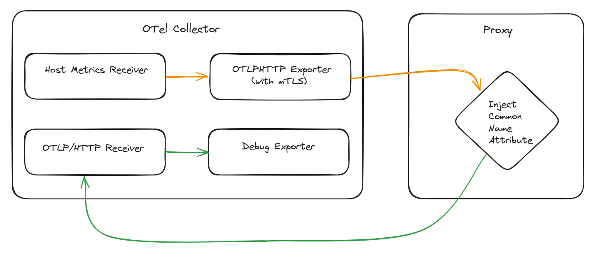

# OTel mTLS Proxy

This proxy is primarily a poc. It is only used to extend the attributes of incoming export
requests by the common name of the certificate TLS used.

### Setup



For the generation and visualization of extended resources the [OpenTelemetry Collector Contrib](https://github.com/open-telemetry/opentelemetry-collector-contrib) is used.
Test metrics are generated by the [Host Metrics Receiver](https://github.com/open-telemetry/opentelemetry-collector-contrib/tree/main/receiver/hostmetricsreceiver) and sent to the proxy via `otlp/http`.
The proxy forwards requests to an otlp receiver, which uses the [debug exporter](https://github.com/open-telemetry/opentelemetry-collector/blob/main/exporter/debugexporter/) for visualization.

#### Generate certificates (optional)

```bash
./tls.sh
```

#### Start Collector

```bash
otelcontribcol --config=config.yaml
```
#### Start Proxy

```bash
otel-mtls-proxy
```
